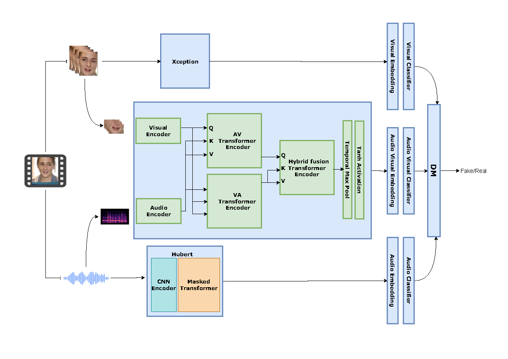

# Teacher-Student Structure for Domain Adaptation in  Ensemble Audio-Visual Video Deepfake Detection (EAV-DFD)


<a href='https://elhamabolhasani.github.io/EAV-DFD/'></a>


## Method Overview

### Basic Model 



### Teacher-Student Model Structure


### Download model
Here is the [link](https://drive.google.com/file/d/1prlLtLJuPdl2R5aq2AD6pLWTgbync68d/view?usp=sharing)  for teacher model.

This project incorporates adapted components from several open-source implementations, including the preprocessing module from [Wav2Lip](https://github.com/Rudrabha/Wav2Lip/blob/master/preprocess.py), audio-visual sub-network elements from the [Vocalist repository](https://github.com/vskadandale/vocalist), and the visual sub-network from the [MCX implementation](https://github.com/xuyingzhongguo/MCX-API/tree/master).


### 🚀 How to Use
This project involves several preprocessing steps followed by model training and evaluation. Follow the instructions below to reproduce the full pipeline.

#### Preprocess the FakeAvCeleb Dataset
First, generate the initial processed dataset from the raw FakeAvCeleb data:

``` bash
python preprocess_fakeavceleb.py
```

#### Run the General Preprocessing Step
Next, apply the main preprocessing script on the previously generated dataset:

``` bash
python preprocess.py
```

#### Create the Ensemble Dataset

Use the provided metadata files (meta_data_train, meta_data_test, meta_data_val) to split the dataset by person source_id and generate ensemble_dataset/ directory.


#### Train the Teacher Model

Set the appropriate configuration in mini_model_config, then run:
``` bash
python train_mini_ensemble_model.py
```

#### Train the Student Model
Set the correct parameters in teacher_student_config, then run:
``` bash
python train_student_model.py
```

#### Test Models
To evaluate the teacher and student models:
``` bash
python test_min_ensemble_model.py
```


## Citation
If you find _EAV-DFD_ useful in your project, please cite our work:
```
@article{
      title={Teacher-Student Structure for Domain Adaptation in  Ensemble Audio-Visual Video Deepfake Detection}, 
      author={ Elham Abolhasani, Maryam Ramezani, and Hamid R. Rabiee},
      year={2026}
}
```

